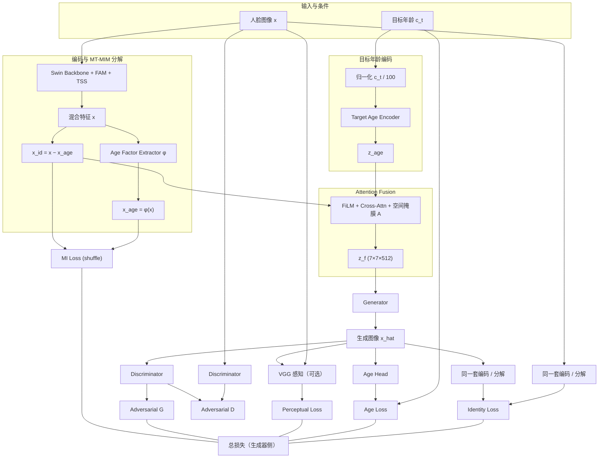

# MT-MIM + 目标年龄条件人脸生成：方法论与流程说明

本文档说明在 `swinface_age_gen` 目录中实现的**扩展方法**：在你原有的 **SwinFace 多任务骨干 + MT-MIM 风格年龄/身份分解**之上，增加**按目标年龄生成人脸图像**的支路，并联合身份保持、年龄监督、对抗与感知约束进行训练。

**数据**：本目录**不复制**大型数据集；`configs/config_age_gen.py` 中路径指向 `../swinface_project/dataset/...`，与原先工程共用同一份数据。

---

## 1. 动机与问题设定

- **输入**：人脸图像 \(x\)，以及希望生成结果所对应的**目标年龄** \(c_t\)（可与当前年龄不同）。
- **输出**：生成图像 \(\hat{x}\)，在视觉上体现目标年龄，同时尽量保持**身份不变**。
- **与 MT-MIM 的关系**：仍从混合特征中显式分解出年龄因子与身份残差（\(x_{\mathrm{age}}=\phi(x)\)，\(x_{\mathrm{id}}=x-x_{\mathrm{age}}\)），在此基础上将**目标年龄编码**与**身份特征**做融合，再经解码器得到 \(\hat{x}\)。

---

## 2. 网络结构（与导师框图对应）

### 2.1 符号

| 符号 | 含义 |
|------|------|
| \(x\) | 输入人脸 |
| \(c_t\) | 目标年龄（标量，与数据集标签同量纲，如「岁」） |
| \(x\) | 经 Swin Backbone + FAM + TSS 后，对 11 路任务特征**在分支维上取均值**得到 512 维混合特征 |
| \(x_{\mathrm{age}}, x_{\mathrm{id}}\) | MT-MIM 风格分解：\(x_{\mathrm{age}}=\phi(x)\)，\(x_{\mathrm{id}}=x-x_{\mathrm{age}}\) |
| \(z_{\mathrm{age}}\) | 目标年龄编码器对 \(c_t/100\)（归一化到 \([0,1]\)）的编码向量 |
| \(z_f\) | 注意力融合后的空间特征图（实现中为 \(7\times7\times512\)） |
| \(\hat{x}\) | 生成器输出的 \(112\times112\times3\) 图像 |

### 2.2 模块说明

1. **Identity Encoder（身份侧）**  
   由现有 **Swin + FAM + TSS** 提取混合特征，再经 **Age Factor Extractor** 得到 \(x_{\mathrm{age}}\)，身份特征为 **残差** \(x_{\mathrm{id}}\)。这与《MT-MIM 实现指南》中的分解一致。

2. **Age Encoder（目标年龄侧）**  
   将标量目标年龄（先除以 `age_norm_max`，默认 100）映射为向量 \(z_{\mathrm{age}}\)，对应框图中的「Target Age → Age Encoder → \(z_{\mathrm{age}}\)」。

3. **Attention Fusion（融合）**  
   实现三类机制（与导师示意图一致 spirit）：
   - **Channel-wise 调制**：对 \(x_{\mathrm{id}}\) 做 FiLM 风格 \(\gamma,\beta\) 调制；
   - **Cross-Attention**：以 \(x_{\mathrm{id}}\) 为 Query，以目标年龄编码得到的 Key/Value 做多头交叉注意力；
   - **Spatial attention mask \(A\)**：由 \([x_{\mathrm{id}}; z_{\mathrm{age}}]\) 经 MLP 产生 \(7\times7\) 的空间门控，乘在融合后的特征图上。

4. **Generator**  
   将 \(7\times7\times512\) 特征经转置卷积上采样至 \(112\times112\)，`tanh` 输出，与训练管线中的归一化 \([-1,1]\) 一致。

5. **Face Recognition / 身份损失**  
   对 \(x\) 与 \(\hat{x}\) 分别再做一次前向分解，得到 \(x_{\mathrm{id}}\) 与 \(x_{\mathrm{id}}^{\hat{}}\)，使用 **余弦一致性损失**（\(1-\cos\) 均值）约束身份接近。对应「原图与生图过同一套编码器 → Identity Loss」。

6. **Age Estimator（年龄头）**  
   对 \(\hat{x}\) 提取混合特征后，经小型 MLP 预测年龄，与 \(c_t\) 做 **Smooth L1**。对应「Age Loss」。

7. **Discriminator**  
   Patch 风格卷积判别器，对 \(x\) 与 \(\hat{x}\) 使用 **Hinge** 形式的对抗损失。

8. **Reconstruction / VGG**  
   - 以概率 `recon_prob` 将 \(c_t\) 设为**真实年龄**，对 \(\hat{x}\) 与 \(x\) 做 **L1 重建**；  
   - 可选 **VGG16-BN 感知损失**（输入由 \([-1,1]\) 映射到 ImageNet 均值方差）。

9. **MT-MIM 互信息项**  
   对 batch 内打乱后的 \(x_{\mathrm{age}}\) 与 \(x_{\mathrm{id}}\) 计算 **MILoss**（与 `train_rest_mtmim` 中思路一致），权重为 `lambda_mi`。

---

## 3. 总损失（实现形式）

\[
\mathcal{L} =
\lambda_{\mathrm{id}}\mathcal{L}_{\mathrm{id}} +
\lambda_{\mathrm{age}}\mathcal{L}_{\mathrm{age}} +
\lambda_{\mathrm{mi}}\mathcal{L}_{\mathrm{MI}} +
\lambda_{\mathrm{rec}}\mathcal{L}_{\mathrm{rec}} +
\lambda_{\mathrm{vgg}}\mathcal{L}_{\mathrm{VGG}} +
\lambda_{\mathrm{adv}}\mathcal{L}_{\mathrm{G\text{-adv}}}
\]

判别器单独优化 \(\mathcal{L}_D\)（Hinge）。

各 \(\lambda\) 在 `configs/config_age_gen.py` 中配置。

---

## 4. 流程图（Mermaid）

---

## 5. 代码与配置入口

| 路径 | 说明 |
|------|------|
| `model_age_gen.py` | `MTMIMAgeGenerationModel`：分解 + 融合 + 生成 + 判别 + 年龄头 + VGG |
| `age_gen/modules.py` | 目标年龄编码、融合、生成器、判别器、VGG 感知 |
| `train_age_generation.py` | 训练循环（生成器与判别器交替、AMP、分布式） |
| `configs/config_age_gen.py` | 数据路径（指向原 `swinface_project/dataset`）、损失权重、训练步数等 |
| `run_age_gen.sh` | 单机 `torchrun` 示例 |

**运行前**：需在工程根目录安装与原项目相同的依赖（如 `easydict`、`timm`、`torch` 等），并将 `config_age_gen.py` 中的数据路径改为你机器上的实际路径。

---

## 6. 训练策略说明

1. **冷启动**：可选 `config.init = True` 并从原 SwinFace 检查点仅加载 **backbone**，加速收敛。  
2. **冻结骨干**：`freeze_backbone_steps` 内关闭 backbone 梯度，先让生成与融合稳定。  
3. **重建混合**：`recon_prob` 控制「目标年龄 = 真实年龄」的比例，提供像素级锚点，减轻模式崩塌。  
4. **目标年龄采样**：非重建分支在 `[target_age_min, target_age_max]` 均匀采样，覆盖不同年龄条件。

---

## 7. 与旧目录的关系

- **`FYP_backup/swinface_project`**：保持不动，继续用于原有识别 / 分析 / MT-MIM 训练。  
- **`FYP_backup/swinface_age_gen`**：仅用于本「年龄条件生成」实验；通过配置文件**复用**原数据集目录，无需复制数据。

若需将生成模型与原有 CosFace 识别头联合微调，可在本框架上增加分支损失或分阶段训练，此处不展开。

---

## 8. 局限与可改进方向

- 当前生成器为轻量卷积解码器，细节与身份保持可进一步用 **更大解码器** 或 **扩散模型** 替换。  
- 身份损失基于 **同一分解头** 的余弦一致性；若需与标准 ArcFace 对齐，可加入 **预训练 ArcFace 冻结网络** 的嵌入损失。  
- IMDB-WIKI **无身份 ID**，身份监督依赖「同图分解一致性」；若有跨年龄配对数据，可增加 **配对重建** 或 **三元组** 约束。

---

*文档版本与代码目录 `swinface_age_gen` 同步，便于开题/中期答辩时直接引用结构图与损失设计。*
